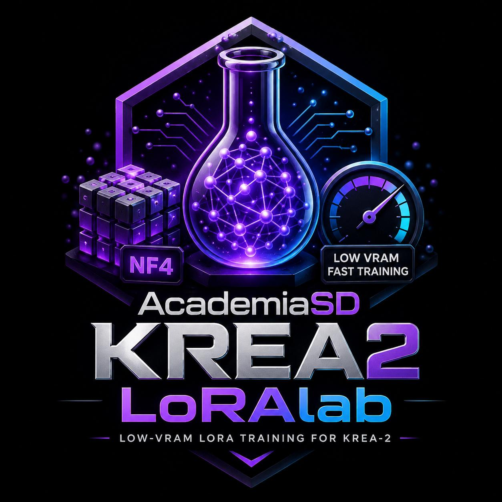

# AcademiaSD LoRAlab-Krea2 Beta v0.75




code
Markdown
# AcademiaSD Krea2 LoRAlab


<p align="center">
  <b>An ultra-fast, low-resource Web GUI & pipeline for training Krea-2 (NF4) LoRAs.</b>
</p>

<p align="center">
  
  
  
  
</p>

---

## 🔬 Technical Deep-Dive: Why is it so fast, light, & high quality?

Training a 12-Billion parameter Diffusion Transformer (DiT) like **Krea 2** typically requires enterprise-grade hardware (30GB+ VRAM, 64GB+ System RAM) and hours of compute. **AcademiaSD Krea2 LoRAlab** breaks this barrier, allowing training on consumer GPUs (8GB–12GB VRAM) in record time while preserving 100% of the model's generation quality. 

Here is the exact architectural breakdown of how this is achieved:

---

### 1. 📉 How VRAM Usage is Reduced to ~7.5 GB

| Memory Component | Standard Training | AcademiaSD Krea2 LoRAlab | Memory Saved |
| :--- | :--- | :--- | :--- |
| **DiT Model (12B)** | ~24.0 GB (FP16/BF16) | **~6.5 GB (4-bit NF4)** | **-73% VRAM** |
| **Text Encoder (Qwen3-VL-4B)** | ~8.0 GB VRAM | **0.0 GB (Offloaded via Pre-Cache)** | **-100% VRAM** |
| **VAE (Qwen-Image)** | ~2.5 GB VRAM | **0.0 GB (Offloaded via Pre-Cache)** | **-100% VRAM** |
| **Optimizer States (AdamW)** | ~6.0 GB VRAM | **~0.2 GB (8-Bit AdamW on BF16 LoRA)** | **-96% VRAM** |
| **Activation Memory** | ~8.0 GB VRAM | **~1.0 GB (Gradient Checkpointing)** | **-87% VRAM** |
| **Total VRAM Peak** | **~48.5 GB** | **~7.7 GB** | **-84% Total VRAM** |

* **4-Bit NormalFloat (NF4) Quantization (`bitsandbytes`)**: The 12-Billion parameter DiT backbone is quantized into 4-bit NF4 weights (`Linear4bit`). Base weights are frozen and pinned to CUDA memory, compressing the 12B model footprint from ~24 GB down to ~6.5 GB.
* **Zero VRAM Wasted on Encoders (Offline Pre-Caching)**: During training (`2_train_lora_krea2.py`), **neither the Text Encoder (Qwen3-VL-4B) nor the VAE are loaded into VRAM**. All text embeddings and image latents are pre-computed once during the pre-cache stage and stored on disk.
* **8-Bit AdamW Optimizer (`bitsandbytes.optim.AdamW8bit`)**: Optimizer states are stored in 8-bit precision instead of 32-bit float, cutting optimizer VRAM overhead by 75%.
* **Gradient Checkpointing**: Intermediate activation tensors are recomputed during backward passes rather than stored in memory, keeping activation VRAM flat regardless of resolution.

---

### 2. ⚡ Why Training Speed is So Fast

* **No Per-Step Encoding Overhead**: In standard pipelines, every training step spends compute cycles passing images through the VAE and prompts through the LLM/Text Encoder. By eliminating this in the pre-cache phase, **100% of GPU compute during training is dedicated purely to the DiT backward pass**.
* **2x2 Latent Patch Packing**: Image latents `[B, C, H, W]` are packed into 2x2 spatial patches (`(H//2)*(W//2)` sequence length). Patching reduces the DiT self-attention sequence length by **4x**, accelerating attention matrix calculations exponentially.
* **Pinned RAM & Non-Blocking CUDA Transfers**: Pre-cached `.pt` latents and embeddings are cached into pinned host memory (`pin_memory()`) and transferred asynchronously to GPU memory (`non_blocking=True`), completely bypassing CPU-to-GPU data bottlenecks.

---

### 3. 🎨 Why Generation Quality is 100% Preserved

* **Exact Channel-Wise VAE Normalization**: Qwen-Image VAE uses specific channel-wise mean and standard deviation tensors (`latents_mean`, `latents_std`). Our pre-caching applies exact channel normalization `(z - mean) / std`, ensuring latent distributions match Krea-2's pre-trained space down to the float.
* **Full-Layer Target Coverage**: LoRA adapters target **all** `Linear` and `Linear4bit` modules across the DiT architecture, enabling deep feature learning (concepts, styles, faces, lighting) rather than surface-level overfitting.
* **Native Krea-2 Noise Shift Schedule**: Implements Krea-2's exact mathematical noise shift function (`calculate_shift`) and logit-normal/shifted timestep sampling (`sample_sigma`), preserving the true velocity-matching diffusion trajectories.

---

## ✨ Features

- **🌐 Modern Web GUI**: Control pre-caching, dataset editing, training, checkpointing, and model export from a sleek single-page web app powered by Flask.
- **🚀 1-Click Auto Launch**: Double-click `Run_LoRAlab-Krea2.bat` to automatically launch the server and open `http://127.0.0.1:5000` in your default browser.
- **📊 Real-Time Hardware Telemetry**:
  - System **RAM** usage.
  - Physical **GPU VRAM** usage (via `nvidia-smi` / `torch`).
  - **GPU Temperature (°C)** with dynamic color coding (Green <70°C, Orange 70–79°C, Red >80°C).
- **🔑 Hugging Face Token Support**: Optional HF token management (`HF_token.json`) for faster model downloads with live progress bars (MBs, transfer speed, ETA).
- **🖼️ Dataset Inspector & Inline Caption Editor**:
  - Visual grid with status badges (🟢 **Green** = Caption present, 🔴 **Red** = Missing caption).
  - Filename tags overlaid on thumbnails.
  - Modal lightbox to view high-res images and **edit `.txt` captions directly on disk**.
  - Batch tool to inject **Trigger Words** across all captions at once.
- **⏱️ Exact Step Resume Checkpoints**: Interrupt or stop training at any step (e.g. Step 333); the exact state (`current_step.txt`, `optimizer.pt`, `adapter_model.safetensors`) is saved automatically. Click **Start/Resume** to continue from that exact step.
- **📂 Automatic Project Folder Management**: Dynamically routes cache and outputs to `./cached_data_krea2_<project>` and `./krea2_lora_output_<project>` based on your project name.
- **🚀 One-Click WebUI Export ("Send to Models")**: Export the best `.safetensors` LoRA directly to your preferred WebUI folder (ComfyUI, Forge, Automatic1111).
- **🌐 Fully Bilingual (English / Español)**: All buttons, console logs, dialogs, and progress bars display labels in both English and Spanish.

---

## 🖥️ System Requirements

| Requirement | Minimum | Recommended |
| :--- | :--- | :--- |
| **OS** | Windows 10/11 or Linux | Windows 11 / Ubuntu 22.04 |
| **GPU** | NVIDIA GPU with **8 GB VRAM** | NVIDIA GPU with **12 GB–24 GB VRAM** |
| **Python** | Python 3.10+ (inside `venv`) | Python 3.10 / 3.11 |
| **CUDA Toolkit** | CUDA 11.8 or 12.1+ | CUDA 12.1+ |

---

## 📦 Installation

1. **Clone the repository**:
   ```bash
   git clone https://github.com/your-username/AcademiaSD-Krea2-LoRAlab.git
   cd AcademiaSD-Krea2-LoRAlab
   ```

2. **Create and activate a virtual environment**:
   ```bash
   python -m venv venv
   .\venv\Scripts\activate
   ```

3. **Install dependencies**:
   ```bash
   pip install torch torchvision --index-url https://download.pytorch.org/whl/cu121
   pip install diffusers peft bitsandbytes safetensors huggingface_hub flask psutil Pillow
   ```

---

## ⚡ Usage Guide

### 1. Launch the Application
Simply double-click the launcher:
```cmd
Run_LoRAlab-Krea2.bat
```
The server will start, and your web browser will automatically open `http://127.0.0.1:5000`.

### 2. Pre-Cache Dataset
1. Enter a **Project Name** (e.g., `cherry2`).
2. Select your image folder using the native Windows file requester (**Browse / Explorar**).
3. Set your target resolution (e.g., `768x768`) and **Multiple** (`8`, `16`, `32`, or `64`).
4. Click **Start Pre-Cache / Iniciar Pre-Caché**.

### 3. Train LoRA
1. Configure **Total Steps** (e.g., `1200`), **Learning Rate** (e.g., `0.0003`), **LoRA Rank/Alpha**, and **Save Every**.
2. Click **Start / Resume**.
3. You can stop training at any time by clicking **Stop Training**; exact step state will be saved automatically for seamless resuming.

### 4. Export to WebUI
1. Enter your preferred **Final LoRA Filename** (e.g., `my_character.safetensors`).
2. Select your ComfyUI / Forge / A1111 `models/loras` directory using **Browse / Explorar**.
3. Click **🚀 Send to Models**.

---

## 📁 Project Structure

```text
AcademiaSD_Krea2_LoRAlab/
├── assets/
│   ├── banner.png             # Web GUI top header banner
│   └── logo.png               # Logo & browser favicon
├── 1_pre_cache_krea2.py        # Latent VAE & Text Embedding pre-caching script
├── 2_train_lora_krea2.py       # DiT 12B NF4 LoRA training script
├── server.py                   # Flask backend web server
├── trainer_ui.html             # HTML5 / CSS3 / JS Web GUI
├── Run_LoRAlab-Krea2.bat       # Windows 1-click launcher
├── pre_cache_settings.json     # Active pre-cache configuration
├── train_settings.json         # Active training configuration
└── HF_token.json               # Optional Hugging Face access token
```

---

## 💬 Community & Support

Join the **AcademiaSD** community to learn more about AI, Stable Diffusion, Flux, and Krea!

- ▶ **YouTube**: [youtube.com/@Academia_SD](https://www.youtube.com/@Academia_SD)
- 𝕏 **X (Twitter)**: [twitter.com/Academia_S_D](https://twitter.com/Academia_S_D)
- 💬 **Discord**: [discord.gg/Syuaduy678](https://discord.gg/Syuaduy678)
- ☕ **Ko-Fi**: [ko-fi.com/academiasd](https://ko-fi.com/academiasd)

---

## 📜 Credits & License

Developed with ❤️ by **AcademiaSD**. Built upon PyTorch, Diffusers, PEFT, Bitsandbytes, and Hugging Face Hub.

